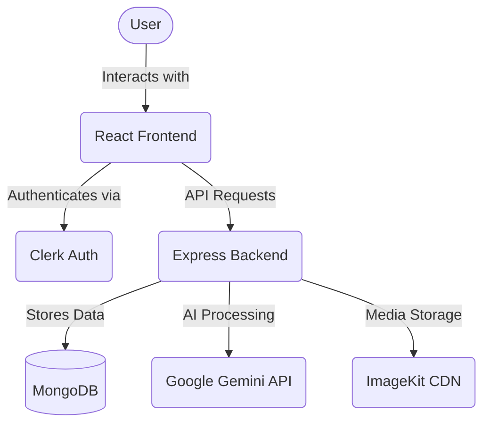

# <div align="center">🧠 NeuroX AI</div>

<div align="center">
  
  <h3>Full-Stack Conversational Intelligence Powered by Google Gemini</h3>
  
  [](https://opensource.org/licenses/MIT)
  [](https://nodejs.org)
  [](https://reactjs.org/)
  [](https://www.mongodb.com/)
  [](https://ai.google.dev/)
</div>

<p align="center">
  <b>NeuroX AI</b> is a state-of-the-art conversational platform that combines the power of Google's Generative AI with an elegant MERN stack architecture. Experience seamless AI interactions through text and image analysis in a sleek, responsive interface designed for the modern web.
</p>

---

## ✨ Key Features

<table>
  <tr>
    <td width="50%">
      <h3>🤖 Advanced Conversational AI</h3>
      <p>Engage in natural, contextually aware conversations powered by Google's Gemini model, offering human-like understanding and responses.</p>
    </td>
    <td width="50%">
      <h3>🖼️ Multimodal Intelligence</h3>
      <p>Upload images for instant AI analysis and receive detailed insights about visual content with impressive accuracy.</p>
    </td>
  </tr>
  <tr>
    <td width="50%">
      <h3>🔐 Enterprise-Grade Security</h3>
      <p>Secure user authentication and session management through Clerk, ensuring your data and conversations remain protected.</p>
    </td>
    <td width="50%">
      <h3>💬 Conversation Memory</h3>
      <p>Access your complete interaction history with the ability to review, continue, or manage past conversations.</p>
    </td>
  </tr>
  <tr>
    <td width="50%">
      <h3>💻 Developer-Friendly Code Blocks</h3>
      <p>Beautifully formatted code snippets with syntax highlighting and one-click copy functionality for seamless development workflows.</p>
    </td>
    <td width="50%">
      <h3>📱 Responsive Experience</h3>
      <p>Enjoy the same powerful features across all devices with a UI that adapts flawlessly from desktop to mobile.</p>
    </td>
  </tr>
</table>

## 🛠️ Technology Stack

### Frontend Architecture
```
React.js (Vite) + TypeScript + Tailwind CSS
├── Material UI Components
├── TanStack Query for State Management
├── React Router for Navigation
```

### Backend Infrastructure
```
Node.js + Express.js + MongoDB
├── Mongoose ORM
├── Clerk Authentication
├── ImageKit Media Management
└── Google Generative AI Integration
```

## 🏗️ Project Structure

```
NeuroX-AI/
│
├── 📁 backend/
│   ├── 📁 models/       # Database schemas and models
│   ├── 📁 routes/       # API endpoint definitions
│   ├── 📁 controllers/  # Business logic handlers
│   ├── 📁 middleware/   # Request processors
│   ├── 📁 utils/        # Helper functions
│   └── 📄 index.js      # Application entry point
│
└── 📁 client/
    ├── 📁 public/       # Static assets
    └── 📁 src/
        ├── 📁 components/  # UI building blocks
        ├── 📁 layouts/     # Page structures
        ├── 📁 lib/         # Utility functions
        ├── 📁 hooks/       # Custom React hooks
        ├── 📁 context/     # State management
        ├── 📁 routes/      # Application routing
        └── 📄 main.jsx     # React entry point
```

## 🚀 Getting Started

### Prerequisites

- Node.js (v14 or above)
- MongoDB instance (local or Atlas)
- Clerk developer account
- ImageKit account
- Google Generative AI API key

### Installation

<details>
<summary><b>1. Clone the repository</b></summary>

```bash
git clone https://github.com/yourusername/NeuroX-AI.git
cd NeuroX-AI
```
</details>

<details>
<summary><b>2. Install dependencies</b></summary>

```bash
# Backend dependencies
cd backend
npm install

# Frontend dependencies
cd ../client
npm install
```
</details>

<details>
<summary><b>3. Configure environment variables</b></summary>

Create `.env` files in both directories:

**Backend (.env)**
```
PORT=5000
MONGODB_URI=your_mongodb_connection_string
CLERK_SECRET_KEY=your_clerk_secret_key
IMAGEKIT_PUBLIC_KEY=your_imagekit_public_key
IMAGEKIT_PRIVATE_KEY=your_imagekit_private_key
IMAGEKIT_URL_ENDPOINT=your_imagekit_url_endpoint
GEMINI_API_KEY=your_google_generative_ai_key
```

**Frontend (.env)**
```
VITE_API_URL=http://localhost:5000
VITE_CLERK_PUBLISHABLE_KEY=your_clerk_publishable_key
VITE_IMAGE_KIT_ENDPOINT=your_imagekit_endpoint
```
</details>

<details>
<summary><b>4. Start development servers</b></summary>

```bash
# Run backend server
cd backend
npm start  # Uses nodemon for hot reloading

# Run frontend
cd ../client
npm run dev  # Vite development server
```

The application will be available at http://localhost:5173
</details>

## 📊 Architecture Diagram



## 🔐 Security Features

- JWT-based authentication flow
- Input sanitization and validation
- Rate limiting and request throttling
- CORS protection
- Environment-based configurations
- Encrypted sensitive data


## 📜 License

This project is licensed under the MIT License - see the [LICENSE](LICENSE) file for details.

## 🙏 Acknowledgments

- **Google Generative AI** for the powerful Gemini model that drives our conversational intelligence
- **Clerk.dev** for providing a robust authentication system
- **ImageKit.io** for efficient image processing and delivery
- **MongoDB** for flexible and scalable data storage
- **The MERN community** for continuous inspiration and innovation

---

---

<div align="center">
  
  <br/>
  
  ```javascript
  // Personal project built with Google's Generative AI
  const creator = {
    name: "Your Name",
    passion: "Building intelligent interfaces",
    project: "NeuroX AI"
  };
  ```
  
  <br/>
  
  <a href="https://github.com/yourusername">
    
  </a>
  <a href="https://www.linkedin.com/in/donthula-saiteja/">
    
  </a>
  
  <p><i>Exploring the possibilities of conversational AI one project at a time</i></p>
</div>
